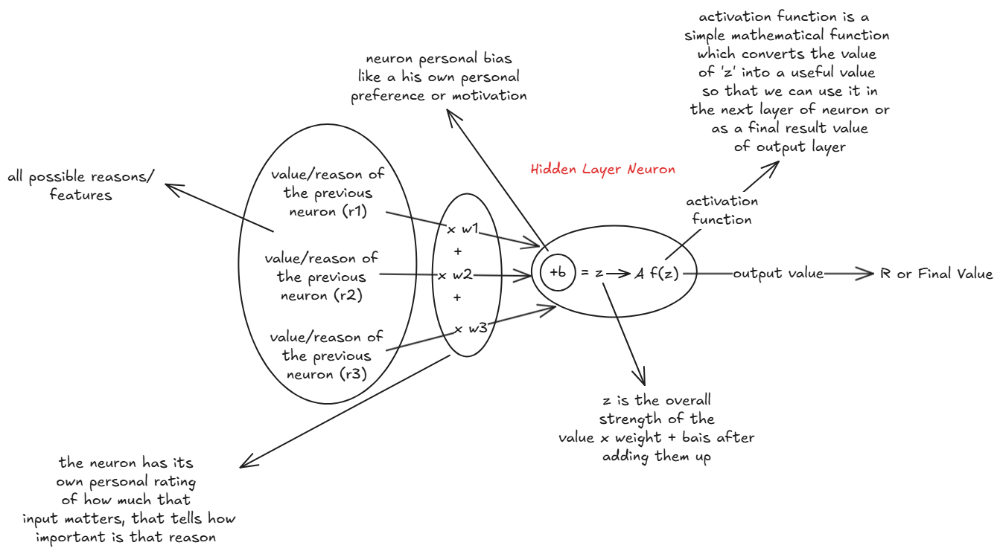

# What is Neural Network?

A neural network is a computational and mathematical model which is inspired by the human brain which has multiple neurons and synapses connected to each other in a order to process the information. The neural network would have multiple layers of neurons where each layer could have multiple neurons and these neurons are going to be connected to the neurons of the next layer. The first layer of the neural network is called the input layer and the last layer of the neural network is called the output layer. The layers in between are called hidden layers. So, the input layers takes the data as input and the output layer gives the output which is a final result that we are looking for.

Okay, so first layer which is input layer have multiple neurons and the number of neurons is depend upon the data we are going to provide to the model. These numbers of neurons is equal to the number of features we have in our data.

## What is a Feature?

So, feature is a some kind of data of (characteristics, properties, attributes) which describes the data and already present in the data.
For example, if we have a data of fruits something like this:

| Color  | Sugar | Content | Acidity | Smell Score | Juice Type |
|--------|-------|---------|---------|-------------|------------|
| Yellow | 12.5  | 3.1     | 7       | 8           | Orange     |
| Red    | 15.0  | 2.5     | 6       | 9           | Apple      |

Here, we have the data of fruits and each fruit has some characteristics or you can say attributes like color, sugar, content, acidity, smell score and juice type. So, all of these are the features of the data which help us to predict or identify the fruit or a attribute of the fruit, or maybe a juice type of the fruit for unseen data.

## How it helps to predict the value of unseen data?

So, the neural network tries to learn or find the relationship between the features of multiple data which we are going to provide to the model.
So, the neural network will try to find the relationship between the features of the data by using the mathematical functions and for a good relationship to be found you have to provide a good amount of data to the model. So, the more data you provide to the model the more accurate the model will be.

## Let's understand, How a single neuron works?



A neuron have Five different core components:

- Input/Feature/Reason: The input is the feature of the data or maybe a output value of the previous neuron.
- Weight: The weight is a value or score for a particular input value (feature).
- Bias: The bias is a single value of a neuron which is added to the weighted sum of the inputs. It describes the motivation or personal preferecnce of the neuron.
- Z (Final Strength): The value of Z is the final strength which is calculated by the weighted sum of (all input/feature x weight) + bias.

Z = (Input1 * Weight1) + (Input2 * Weight2) + ... + (InputN * WeightN) + Bias

Let's take a example to understand what are these components and how they works:-

Let's say we have a question to answer 'yes' or 'no'!
**Question:** "Hey, should we start this project today?"

## (R) Reasons/Features

We have some reasons or some kind of features or information that helps to answer this question like:

- We have time
- The idea is exciting
- The tools are not ready

So, all of these are the reasons or features which helps the neuron to answer the question.

## (W) Weights

Weights are the rating system of the neuron which shows the importance of neuron or how much the neuron is care about these reasons or features.

- We have time! : +0.8 Why? (If we have time then we can start the project today)
- The idea is exciting! : +1.2 Why? (If the idea is exciting then we can start the project today)
- Tools not ready! : -1.0 Why? (If the tools are not ready then we can't start the project today)

So, that's why we have to multiply the weights with the reasons or features to get the final strength of the neuron.

## (B) Bias

Bias is the personal preference of the neuron which is added to the weighted sum of the inputs. It describes the motivation or personal preference of the neuron.

Let's say for the all reasons or features rating is made something like this:

- We have time! : 0
- The idea is exciting! : 0
- The tools are not ready! : 0

So, it means the neuron is not care about these reasons or features and it will not answer the question based on these reasons or features. So, we have to add a bias to the weighted sum of the inputs to get the final strength of the neuron.

So, bias helps the neuron to answer the question even (reasons) x (weights) are 0 then by adding a bias the neuron can answer the question.
Bias is kind of a motivation of the neuron which helps the neuron still answer the question even if the reasons are not good enough to answer the question.

## (Z) Final Strength

So, the final strength of the neuron is calculated by the weighted sum of (all input/feature x weight) + bias.

Now, at last we have a final value or final strength of the equation which is called Z. And it may possible that the Z value becomes negative if all the reasons are nagative which gona make the final strength negative. But negative value is not gonna work because -1 or -15, -9999 is more likely to be 'no' so we have to convert the negative value into some kind of useful value which we can use it to answer the question. For that we have to use a activation function which is a mathematical function which converts the negative value into some kind of useful value.

## (A) Activation Function

There can be multiple activation functions like sigmoid, relu, tanh, softmax etc. Which converts the value into different values and they all are used for different purposes.

### Sigmoid

```
sigmoid(z) = 1 / (1 + exp(-z))
```

- Outputs a value between 0 and 1
- Good for "yes/no", "probability-ish" outputs
- Squishes big values into a soft limit

| z	 |  Output |
|----|---------|
| -3 |	0.047  |
| 0	 |  0.5    |
| +3 |	0.952  |

👎 Downside: slow to train, gradients vanish on extremes

### Tanh (Hyperbolic Tangent)

```
tanh(z) = (exp(z) - exp(-z)) / (exp(z) + exp(-z))
```

- Outputs between -1 and 1
- Like a centered sigmoid
- Better for deep networks than sigmoid

👎 Still suffers from vanishing gradients sometimes

### ReLU (Rectified Linear Unit)

```
ReLU(z) = max(0, z)
```

- Super simple, super fast
- If z is positive → pass it through
- If z is negative → cut it to zero

| z	    | Output |
|-------|--------|
| -5    | 0      |
| 0	    | 0      |
| +3.5 	| 3.5    |

🔥 Used in almost all modern networks because it trains fast and strong

👎 Downside: “Dead neurons” if too many negatives, they get stuck at 0

### Softmax (for multi-class classification)

- Used in the output layer when you want probabilities across multiple classes
- Outputs values that sum to 1, like:

```
[0.1, 0.3, 0.6]
```

- It's helps to predict the class of the data by checking the highest probability value.
